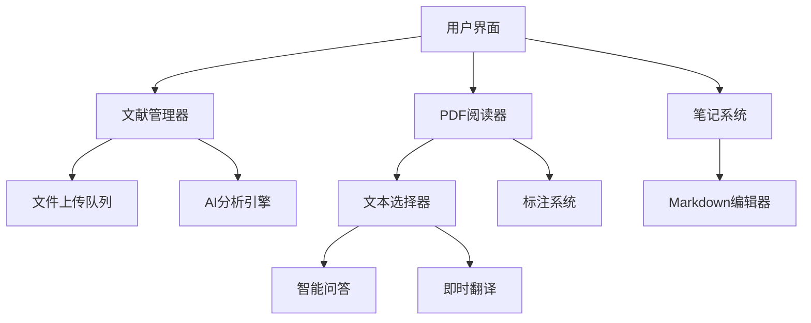

<h1 align="center">SmartLiteratureManager 🚀 智能文献分析系统<h1>

<div align="center">
  
  
  
  
</div>

<div align="center">
  
  <br>
  <em>🚀 一键开启智能科研新时代</em>
</div>

## 🌟 核心特性

### 📚 智能文献管理
- 多格式支持：PDF/TXT文件一键导入
- 自动内容提取：智能识别文献核心内容
- 批量处理：队列式上传与后台分析

### 🧠 AI增强分析
- 结构化解析：自动生成研究背景/方法/发现/创新点
- 智能问答系统：文献内容深度交互
- 专业翻译引擎：学术术语精准翻译

### 🎨 沉浸式阅读
- 高性能PDF渲染：支持标注与笔记联动
- 智能高亮系统：关键内容自动标记
- 跨页导航：智能目录与快速跳转

### 📝 知识管理
- 上下文笔记系统：支持页面定位标注
- Markdown编辑器：实时语法高亮
- 笔记导出：JSON格式标准化存储

## 🛠️ 安装指南

```bash
# 克隆仓库
git clone https://github.com/Saeran-Chang/SmartLiteratureManager.git

# 安装依赖
pip install -r requirements.txt

# 启动程序
python main.py
```

## 🖥️ 使用说明

### 快速入门
1. **API配置**：通过设置对话框输入Moonshot API密钥
2. **文献导入**：支持拖放或文件选择器批量导入
3. **智能分析**：自动生成结构化文献报告
4. **交互探索**：右键菜单启动翻译/问答/笔记功能

### 核心交互
| 功能            | 快捷键             | 说明                      |
|----------------|-------------------|-------------------------|
| 快速搜索        | Ctrl+F            | 跨页内容检索               |
| 智能问答        | Ctrl+Enter        | 发送当前问题               |
| 内容翻译        | -------           | 翻译选中文本               |
| 笔记定位        | -------           | 关键页面添加笔记            |

## 📂 项目结构

```text
SmartLiteratureManager
├── AnalysisResults
├── Assets
│ ├── logo.ico
│ └── logo.png
├── Components
│ ├── LiteratureManager.py
│ ├── NoteManagementWidget.py
│ ├── PDFDisplayLabel.py
│ └── PDFViewerWidget.py
├── Config
│ └── Config.py
├── Content
│ └── content.json
├── Dialog
│ └── SettingDialog.py
├── style
│ ├── LiteratureStyle.qss
│ └── PDFViewerStyle.qss
├── Utils
│ ├── ChatTextEdit.py
│ └── MarkdownHighlighter.py
├── Workers
│ ├── AnalysisWorker.py
│ ├── BaseWorker.py
│ ├── ChatWorker.py
│ └── FileUploadWorker.py
├── main.py
└── requirements.txt

```

## ⚙️ 技术架构



## 🔧 配置说明

1. 获取Moonshot API密钥
2. 在设置对话框配置密钥
3. 自定义样式表（可选）：
   - `LiteratureStyle.qss` 主界面样式
   - `PDFViewerStyle.qss` 阅读器主题

## 📌 注意事项

- 确保网络连接正常（API依赖）
- 首次启动会自动创建配置目录
---

<div align="center">
  <i>📚 探索知识边界 | 🤖 智能科研伴侣 | 🚀 高效文献管理</i>
</div>
